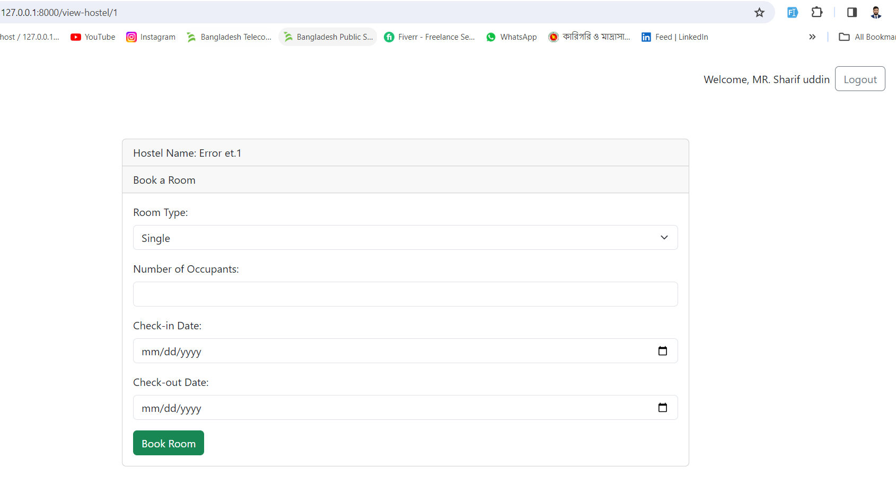
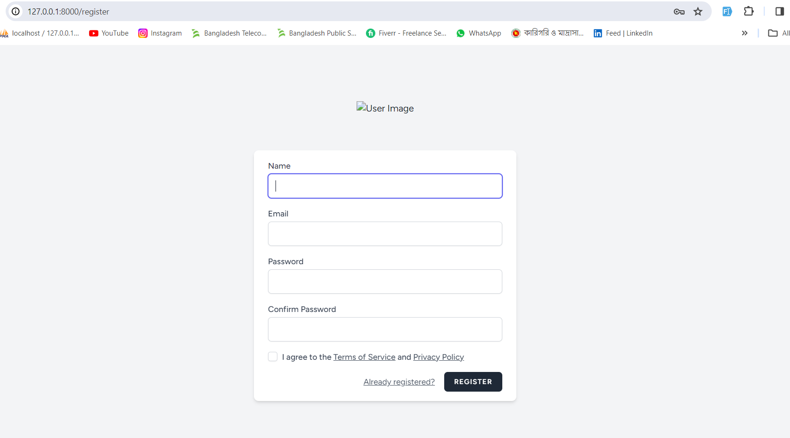

# Hostel Booking System

This is a hostel booking system built with Laravel. The system allows users to register, login, and book rooms in hostels.

## Installation

1. Clone the repository:

   ```bash
   git clone https://github.com/yourusername/hostel-booking-system.git
   ```

   Navigate into the project directory:

   ```
   cd hostel-booking-system
   ```

Install dependencies:

```
composer install
```

Copy the .env.example file to .env and configure your environment variables, including the database connection.

Generate application key:

```
php artisan key:generate
```

Migrate the database:

```
php artisan migrate
```

Seed the database:

```
php artisan db:seed
```

UsersTableSeeder: Creates sample users.
HostelSeeder: Seeds the hostels table with sample data.
To seed the database, run:

Usage
To access the application, navigate to

http://localhost:8000


in your browser.

Users can register for an account to book hostels.

After Register in, users can book rooms in available hostels.
Routes
http://127.0.0.1:8000/user/register


View hostel and book
http://127.0.0.1:8000/view-hostel/1



Booking


Sent Email


Admin register
http://127.0.0.1:8000/register


Admin Login
http://127.0.0.1:8000/login


Booking confirmations
http://127.0.0.1:8000/admin/customer-booking


License
This project is licensed under the MIT License.

vbnet

Customize the sections and content according to your project's specifics. This `README.md` will provide users with essential information about your hostel booking system.
